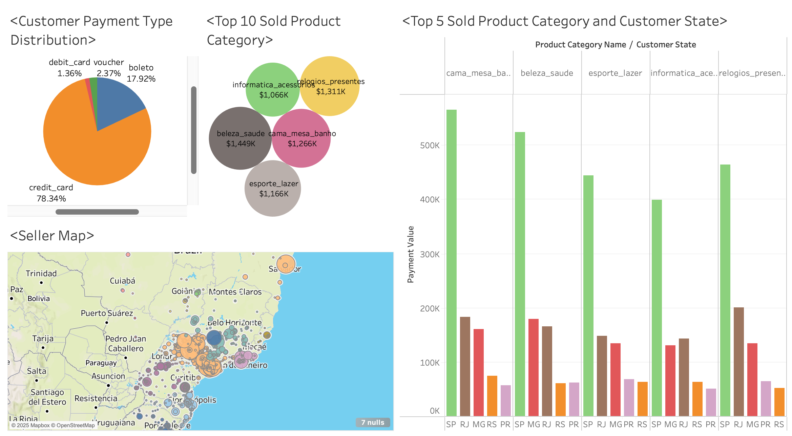
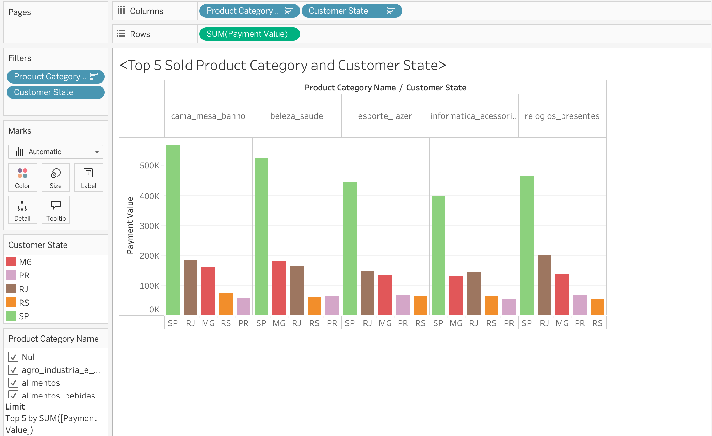
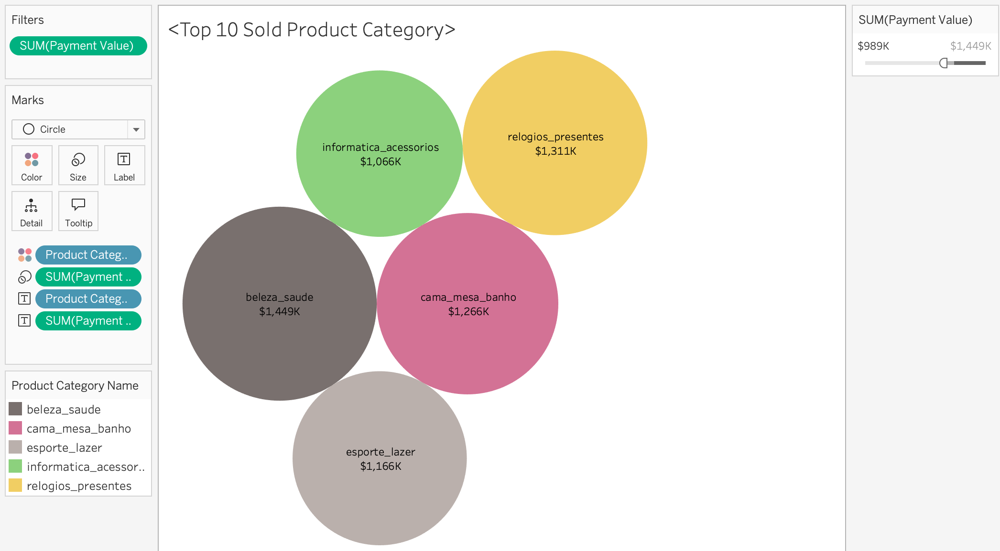
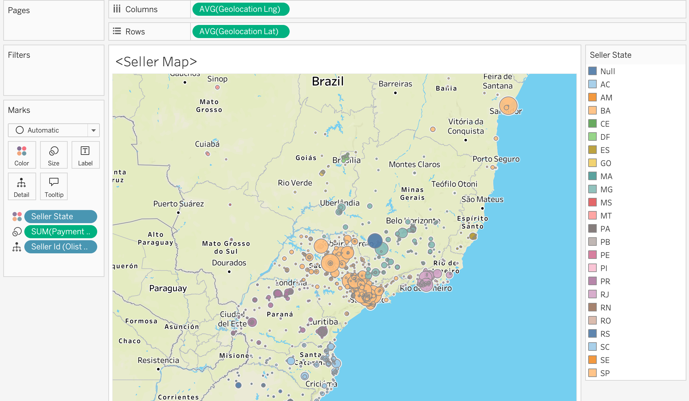
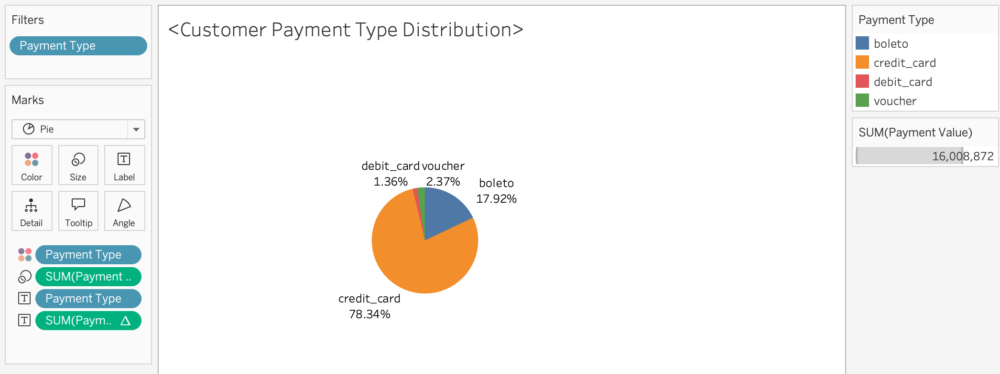

Finish Date:2025-08-12

# Introduction

This project is based on the "Olist Brazilian E-commerce Public Dataset" from Kaggle, aiming to gain market insights through data visualization. The dataset contains detailed information on over 100,000 orders from the Olist store between 2016 and 2018, covering multiple dimensions such as customers, products, payments, and geolocation.

To intuitively present the analysis, I built an interactive dashboard using Tableau. The dashboard focuses on key e-commerce metrics, including customer payment type distribution (with a focus on credit card payments), best-selling product categories (such as computer accessories and sports & leisure), and product sales performance by Brazilian state. Additionally, a seller map clearly visualizes the geographical distribution of sellers, providing a comprehensive overview of the Brazilian e-commerce ecosystem.

# Visualizations

